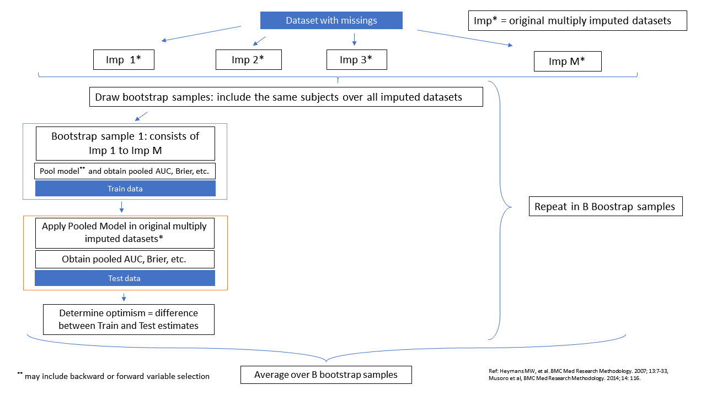

# Introduction

This page contains information of the `MI_boot` method that is implemented 
in the [`psfmi`](https://github.com/mwheymans/psfmi) package and that combines 
Multiple Imputation with bootstrapping for the validation of 
logistic regression / prediction models. Internal validation is always done of the last model that is 
selected by the function `psfmi_lr`. An explanation and examples of how to use the methods can be found below.

# Method MI_boot

With this method bootstrap samples are drawn from each multiply imputed dataset. 
The same cases are drawn in each imputed dataset. The pooled model is analyzed 
in the each bootstrap training data and subsequently tested in original multiply imputed data. 
The method can be performed in combination with backward or forward selection.

How these steps work is visualized in the Figure below. 

```{r, echo = FALSE, fig.cap="Schematic overview of the boot_MI method", out.width='100%', fig.align='center'}


```

# Examples

* [Method MI_boot]
* [Method MI_boot including BW selection]

## Method MI_boot 

internal validation is done of the last model that is selected by the function `psfmi_lr`. 
In the example below, `psfmi_lr` is used with `p.crit` set at 1. This setting is also
used in the `psfmi_perform` function. This means that first the full model is pooled and
subsequently interval validation is done of the full model.  

```{r}

library(psfmi)
pool_lr <- psfmi_lr(data=lbpmilr, formula = Chronic ~ Pain + JobDemands + rcs(Tampascale, 3) +
                   factor(Satisfaction) + Smoking, p.crit = 1, direction="FW",
                 nimp=5, impvar="Impnr", method="D1")

set.seed(200)
res <- psfmi_perform(pool_lr, val_method = "MI_boot", nboot = 5, p.crit=1)
res

  
```

Back to [Examples]

## Method MI_boot including BW selection

Internal validation is done of the last model that is selected by the function `psfmi_lr`. 
In the example below, `psfmi_lr` is used with `p.crit` set at 1, and pooling is than done 
without variable selection, i.e. the full model is pooled. When subsequently interval 
validation is done with the `psfmi_perform` function including BW, BW is applied in 
each bootstrap sample from the full model.  

```{r}

library(psfmi)
pool_lr <- psfmi_lr(data=lbpmilr, formula = Chronic ~ Pain + JobDemands + rcs(Tampascale, 3) +
                   factor(Satisfaction) + Smoking, p.crit = 1, direction="FW",
                 nimp=5, impvar="Impnr", method="D1")

set.seed(200)
res <- psfmi_perform(pool_lr, val_method = "MI_boot", nboot = 5, p.crit=0.05, direction = "BW")
res

```

Back to [Examples]


