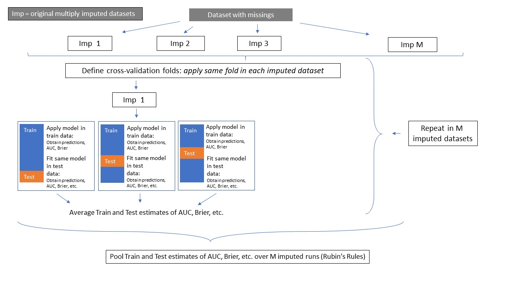

# Introduction

This page contains information of the `MI_cv_naive` method that is implemented 
in the [`psfmi`](https://github.com/mwheymans/psfmi) package and that combines 
Multiple Imputation with Cross-validation for the validation of 
logistic regression / prediction models. Currently the method is only available 
via downloading the `psfmi` package via Github. Do this:

 install.packages("devtools")
 
 library(devtools)
 
 devtools::install_github("mwheymans/psfmi")
 
 library(psfmi)

The `MI_cv_naive` method is implemented in the function `psfmi_perform`. 
An explanation and examples of how to use the method can be found below.

# Method MI_cv_naive
      
This method applies cross-validation after Multiple Imputation. The same folds
are used in each multiply imputed dataset. Is is possible to do backward 
selection during cross-validation. How this method works is visualized 
in the Figure below. 

```{r , echo = FALSE, fig.cap="Schematic overview of the MI_cv_naive method", out.width='100%', fig.align='center'}


```

# Examples

* [Method MI_cv_naive]
* [Method MI_cv_naive including BW selection]

## Method MI_cv_naive

To run the MI_cv_naive method use:

```{r}

library(psfmi)
pool_lr <- psfmi_lr(data=lbpmilr, formula = Chronic ~ Pain + JobDemands + rcs(Tampascale, 3) +
                   factor(Satisfaction) + Smoking, p.crit = 1, direction="BW",
                   nimp=5, impvar="Impnr", method="D1")

set.seed(100)
res_cv <- psfmi_perform(pool_lr, val_method = "MI_cv_naive", folds = 5,
                     p.crit=1, BW=FALSE)
res_cv

```

Back to [Examples]

## Method MI_cv_naive including BW selection

To run the MI_cv_naive method by implementing backward variable selection during cross-validation use:

```{r}

library(psfmi)
pool_lr <- psfmi_lr(data=lbpmilr, formula = Chronic ~ Pain + JobDemands + rcs(Tampascale, 3) +
                   factor(Satisfaction) + Smoking, p.crit = 1, direction="BW",
                   nimp=5, impvar="Impnr", method="D1")

set.seed(100)
res_cv <- psfmi_perform(pool_lr, val_method = "MI_cv_naive", folds = 5,
                     p.crit=0.05, BW=TRUE)
res_cv

  
```

Back to [Examples]
