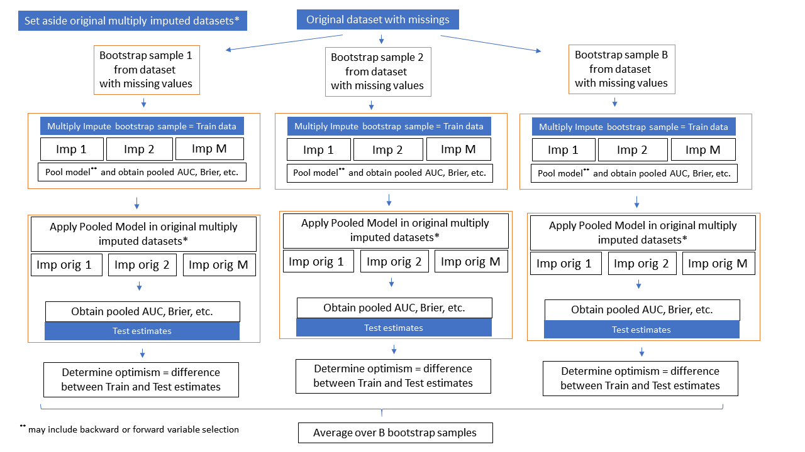

# Introduction

This page contains information of the `boot_MI` method that is implemented 
in the `psfmi_perform` function of the [`psfmi`](https://github.com/mwheymans/psfmi) package and that combines 
Multiple Imputation with bootstrapping for the validation of 
logistic regression / prediction models. Currently the method is only available 
via downloading the `psfmi` package via Github. Do this:

 install.packages("devtools")
 
 library(devtools)
 
 devtools::install_github("mwheymans/psfmi")
 
 library(psfmi)

The `boot_MI` method is implemented in the function `psfmi_perform`.
An explanation and examples of how to use the methods can be found below.

# Method boot_MI

With the method boot_MI, first bootstrap samples are drawn from the original
dataset with missing values and than multiple imputation is applied in each 
bootstrap sample. The pooled model is analyzed in the each bootstrap training data 
and subsequently tested in original multiply imputed data. The method can be 
performed in combination with backward or forward selection selection.

How these steps work is visualized in the Figure below. 

```{r , echo = FALSE, fig.cap="Schematic overview of the boot_MI method", out.width='100%', fig.align='center'}


```

# Examples

* [Method boot_MI]
* [Method boot_MI including BW selection]
* [Method boot_MI including FW selection]

## Method boot_MI 

To run the boot_MI method use:

```{r}

library(psfmi)
pool_lr <- psfmi_lr(data=lbpmilr, formula = Chronic ~ Pain + JobDemands + rcs(Tampascale, 3) +
                   factor(Satisfaction) + Smoking, p.crit = 1, direction="FW",
                 nimp=5, impvar="Impnr", method="D1")

res_MI_boot <- psfmi_perform(pool_lr, val_method = "boot_MI", data_orig = lbp_orig, nboot = 5,
                     p.crit=1, nimp_mice = 3, direction = "BW", miceImp = miceImp,
                     printFlag = FALSE)

res_MI_boot
  
```

Back to [Examples]

## Method boot_MI including BW selection

To run the boot_MI method including backward selection:

```{r}

library(psfmi)
pool_lr <- psfmi_lr(data=lbpmilr, Outcome="Chronic", predictors = c("Pain", "JobDemands", "Smoking"), 
                   cat.predictors = "Satisfaction", spline.predictors = "Tampascale", nknots=3,
                   p.crit = 1, direction="FW", nimp=5, impvar="Impnr", method="D1")

res_MI_boot <- psfmi_perform(pool_lr, val_method = "boot_MI", data_orig = lbp_orig, nboot = 5,
                     p.crit=0.05, nimp_mice = 3, direction = "BW", miceImp = miceImp,
                     printFlag = FALSE)

res_MI_boot

```

Back to [Examples]

## Method boot_MI including FW selection

To run the boot_MI method including forward selection:

```{r}

library(psfmi)
pool_lr <- psfmi_lr(data=lbpmilr, formula = Chronic ~ Pain + JobDemands + rcs(Tampascale, 3) +
                   factor(Satisfaction) + Smoking, p.crit = 1, direction="FW",
                 nimp=5, impvar="Impnr", method="D1")

res_MI_boot <- psfmi_perform(pool_lr, val_method = "boot_MI", data_orig = lbp_orig, nboot = 5,
                     p.crit=0.05, nimp_mice = 3, direction = "FW", miceImp = miceImp,
                     printFlag = FALSE)

res_MI_boot

  
```
