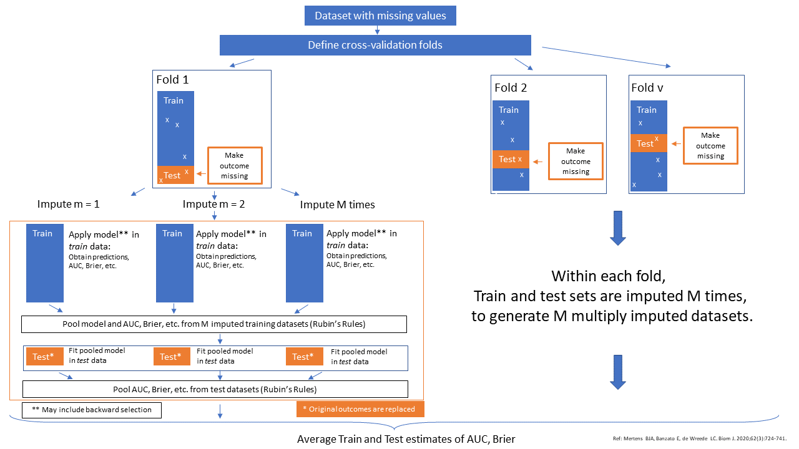

# Introduction

This page contains information of the `cv_MI_RR` method that combines 
Multiple Imputation with Cross-validation for the validation of 
logistic prediction models. This cross-validation method is 
based on the paper ofs [Mertens BJ](https://onlinelibrary.wiley.com/doi/full/10.1002/bimj.201800289) 
and [Miles A](https://journals.sagepub.com/doi/abs/10.1177/0049124115610345).
The `cv_MI_RR` method is implemented in the function `psfmi_perform`.
An explanation and examples of how to use the methods can be found below.

# Method cv_MI_RR

The method cv_MI_RR uses multiple imputation within the cross-validation 
definition. The pooled model is analyzed in the training data and 
subsequently tested in the test data. The method can be performed 
in combination with backward selection of the pooled model in the training set 
and subsequently testing the performance of the pooled model in the test set. 
The method can only be performed when the outcome data is complete.

How these steps work is visualized in the Figure below. 

```{r , echo = FALSE, fig.cap="Schematic overview of the cv_MI_RR method", out.width='100%', fig.align='center'}

```

# Examples

* [Method cv_MI_RR]
* [Method cv_MI_RR including BW selection]

## Method cv_MI_RR 

To run the cv_MI_RR method use:

```{r}

library(psfmi)
pool_lr <- psfmi_lr(data=lbpmilr, formula = Chronic ~ Pain + JobDemands + rcs(Tampascale, 3) +
                   factor(Satisfaction) + Smoking, p.crit = 1, direction="BW",
                   nimp=5, impvar="Impnr", method="D1")

set.seed(200)
res_cv <- psfmi_perform(pool_lr, val_method = "cv_MI_RR", data_orig = lbp_orig, folds = 3,
                     p.crit=1, BW=FALSE,  nimp_mice = 5, miceImp = miceImp, printFlag = FALSE)

res_cv

  
```

Back to [Examples]

## Method cv_MI_RR including BW selection

To run the cv_MI_RR method including backward selection:

```{r}

library(psfmi)
pool_lr <- psfmi_lr(data=lbpmilr, formula = Chronic ~ Pain + JobDemands + rcs(Tampascale, 3) +
                   factor(Satisfaction) + Smoking, p.crit = 1, direction="BW",
                   nimp=5, impvar="Impnr", method="D1")

set.seed(200)
res_cv <- psfmi_perform(pool_lr, val_method = "cv_MI_RR", data_orig = lbp_orig, folds = 3,
                     p.crit=0.05, BW=TRUE, nimp_mice = 5, miceImp = miceImp, printFlag = FALSE)

res_cv

  
```

Back to [Examples]
